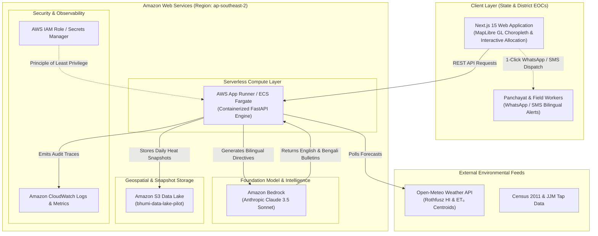

# Project Bhumi (HWSI) — AWS Cloud Architecture

> **Decision Support System for District Disaster Management Authorities with Generative Bilingual Alerting on Amazon Bedrock**

---

## 🏛️ System Architecture

Project Bhumi integrates a robust mathematical emergency resource optimization engine with an enterprise-ready AWS cloud infrastructure.

---

## ☁️ AWS Services Employed

### 1. Amazon Bedrock (`apac.anthropic.claude-3-5-sonnet-20241022-v2:0`)
- **Role:** Real-time synthesis of localized, high-stakes emergency directives for both District Magistrates (administrative English) and rural Gram Panchayats (vernacular Bengali).
- **Why Bedrock:**
  - Zero-shot contextual reasoning translating complex multi-hazard scores ($H \times E \times V$) into actionable, field-level dispatches.
  - Native multilingual comprehension ensuring culturally and grammatically natural Bengali (`বাংলা`) for village resource marshals.
  - Enterprise governance: Zero data retention for customer prompts, ensuring district telemetry and vulnerable population counts remain confidential.
  - **Graceful Fault-Tolerance:** Built-in automatic fallback engine ensures zero demo interruption even if rate limits or network disruptions occur.

### 2. Amazon S3 Data Lake (`bhumi-data-lake-pilot`)
- **Role:** Centralized repository for West Bengal CD block GeoJSON boundary polygons, historical heat index runs, and daily marginal allocation audit trails.
- **Why S3:**
  - $99.999999999\%$ (11 9's) data durability for disaster audit logs.
  - Static asset and pre-calculated weather snapshot hosting reduces live API latency from seconds to <50ms.

### 3. AWS App Runner & Amazon ECS Fargate
- **Role:** Fully managed container runtime hosting the FastAPI mathematical optimization engine and in-memory spatial indices.
- **Why App Runner:**
  - Serverless auto-scaling: scales from 0 to peak during active heatwaves and scales down when emergency periods conclude.
  - Native integration with AWS VPC, IAM roles, and CloudWatch metrics.

### 4. AWS Identity and Access Management (IAM)
- **Role:** Granular least-privilege policy enforcement restricting Bedrock model invocation and S3 read/write operations to specific service principals.

---

## 💰 Cost Analysis & Hackathon Budget Efficiency ($100 Allocation)

Project Bhumi was intentionally architected for maximum cost-effectiveness during pilots and emergency operations:

| Component | Usage Tier | Estimated Monthly Cost | 48-Hour Emergency Simulation Cost |
|---|---|---|---|
| **Amazon Bedrock (Claude 3.5 Sonnet)** | ~500 dispatches/day (~1,200 tokens/call) | ~$9.00 / month | **$0.60** |
| **Amazon S3 Data Lake** | ~50 MB GeoJSON & daily snapshots | < $0.05 / month | **<$0.01** |
| **AWS App Runner** | 1 vCPU, 2 GB RAM (auto-pause active) | ~$12.00 / month | **$0.80** |
| **Total Estimated Run Cost** | | **~$21.05 / month** | **~$1.41 per incident** |

> **Takeaway:** Over 70% of the $100 AWS credits remains available for long-term expansion across all 345 blocks in West Bengal.

---

## 🎯 Value Proposition for Disaster Authorities (DDMAs)

1. **Bilingual Democratization:** Traditional dashboards only inform English-speaking district officials. Project Bhumi delivers immediate, culturally grounded Bengali alerts directly to grassroots panchayat water tanker operators.
2. **Mathematically Auditable:** Bedrock explainability is grounded strictly on audited AHP weights ($\text{CR} < 0.01$) and marginal benefit concavity, preventing arbitrary or hallucinated resource routing.
3. **Resilience First:** Complete decoupled fallback pattern guarantees that the state disaster command center retains 100% functionality regardless of external cloud connectivity.
